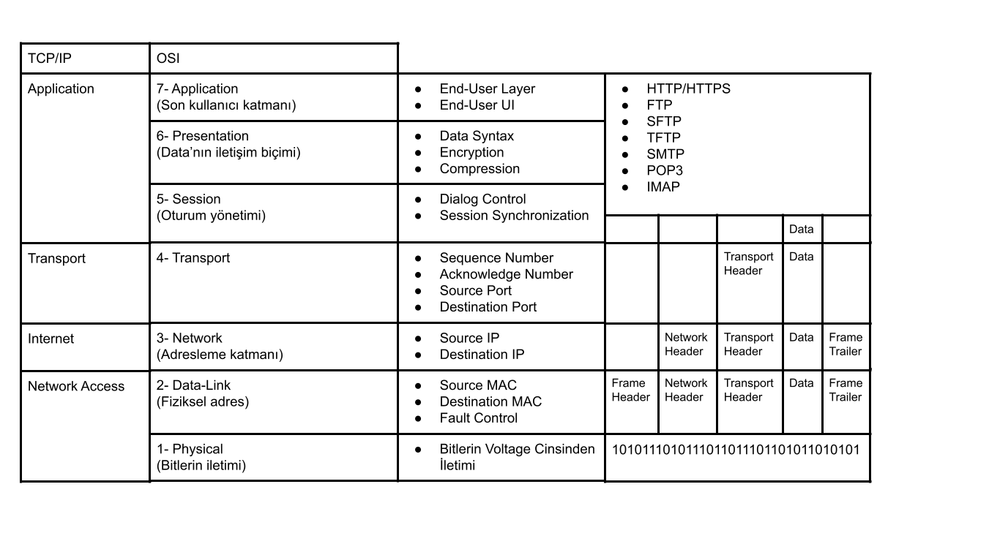
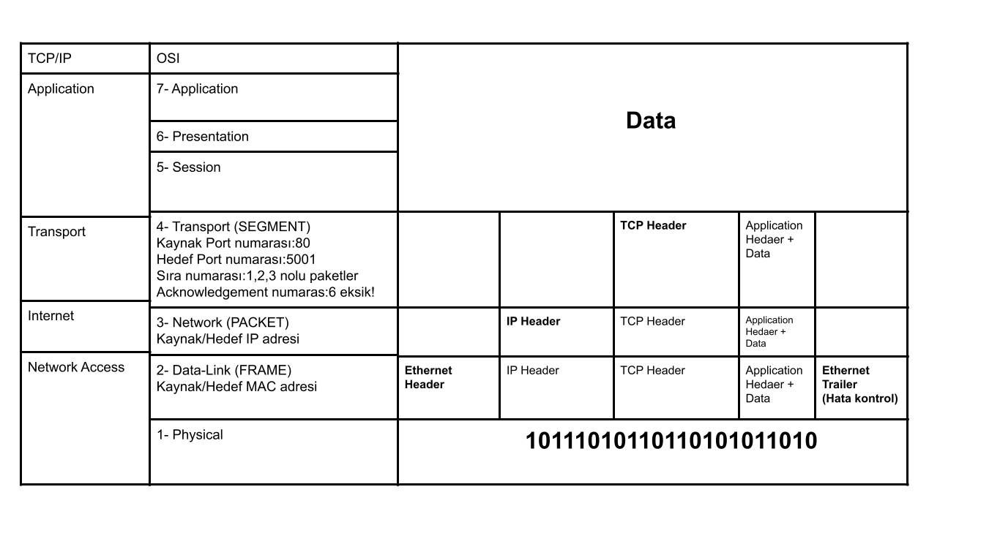

# 3- Protokoller ve Modeller

**TCP/IP**: Günümüzdeki internette kulanılan, 4 katmandan oluşan, protokol kümesidir.

**OSI**: Data haberleşmesinin anlatılması ve açıklanması için tasarlanmış 7 katmandan oluşan modeldir.

## MAC Adresleri ve IPv4 Adresleri
- MAC ve IP, cihazların, aralarındaki iletişimi gerçekleştirmelerinde kullandıkları adreslerdir.

#### **MAC Adresleri:**
- **48 bitten** oluşurlar.
- NIC üzerinde bulunurlar, fiziksel adres olarak da geçerler, eşsizdirler.
- MAC adresleri *9C-35-5B-5F-AA-BB* tazrındadırlar (*0000=0, 0001=1, 0010=2, ..., 1110=E, 1111=F*).
- Ethernet Kartı üzerinde **Bured-in adres**lerdir.
- NIC üzerinde çalışan internet protokolleri cihaz içerisine yüklü gelir ancak istenirse değiştirilebilir, bunlar TCP/IPv4 veya TCP/IPv6'dır.

*Wifi kartı da bir NIC kartıdır.*
#### **IPv4 Adresleri:**
- **32 bit** / 4 kısımdan oluşurlar.
- IP adresleri 192.168.1.5 tazrındadır, alabileceği sayılar (0-255) aralığında olmalıdır, 0 ya da 255 alamazlar. 
- IP adresleri, MAC adreslerindeki kalıcı adreslerin tersine **mantıksal** adreslerdir. "Dynamic addresses" yani dinamik adresler olarak tanımlanırlar.
- IP adresi "192.168.5.1" olan bir cihazın "192.168.5" kısmı "Network" bilgilerini ifade ederken, ".1"  kısmı ise yerel ağdaki "Host" numarasıdır.

### Hatırlatma:
*Router networkleri birbirine bağlayan  ağ cihazıdır, router uçları (interfaceleri) farklı ağlara bakar. Yani bir port 192.168.5 ağına bakıyorsa diğer port 192.168.6 ağına bakar.*
*Switch ise son kullnıcıları ağa dahil eden  cihazdır.*

## ŞEKİL 1_3_1

***

### İletişim Temelleri Oluşturan Temel Unsurları:
- Source (Kaynak).
- Destination (Hedef).
- Media (Ortam).

*Ağlar "scale" ve "complexity" olarak değişebilir, yalnızca bağlantı olması yetmez.*
***
### Mesajların Ağ'daki Hareketi:

*Message Source > Transmitter > Transmission Medium > Reciever > Message Destination*
***
## İletişim Protokolleri:
- Tüm iletişim protokoller çerçevesinde gerçekleşir.
- Protokoller iletişimin izleyeceği kurallardır.
- Kurallar protokollere bağlıdır. Kurallar dizisine ise protokol denir.

5 temel iletişim protokolü vardır, bunlar:

### 1- Encoding:

- Mesajın fiziksel ortamda iletilmesi için uygun hale getirilme işlemidir.
- Encoding işleminin tersi **decoding**'tir, mesajın yorumlanması için çözümlenmesidir.
- Hostlar arası kodlama ortama uygun olmalıdır. Bitler ışık, ses veya elektriksel darbe modeline dönüştürülür, hedef (destination) bunu decoding yardımıyla çözümler.

### 2- Formatting and Encapsulation:

- Bir mesajın gönderilirken belli bir formatta ya da yapıda olması gerekmektedir. Bu format mesajın türüne ve mesaj iletmek için kullanan kaynaklara bağlıdır.

*Data'nın içerisinde version, traffic class, flow control, payload lenght etc. olması bir formatlamdır.*

*Foreshadowing: Encoding fiziksel katmana özgü bir durumken, encapsulation bütün katmanları kapsar.*

### 3- Message Size:

- 500 MB'lık bir dosyayı istersek tek parça halinde gönderebiliriz, ancak iletim sırasında bir sorun sonucu yalnızca bir bit bile yanlış aktarılırsa bütün veri kullanılmaz hale gelir. Bu ölçeklendirilebilir ve kullanışlı değildir. 
- Datayı, küçük parçalar halinde yollamak istersek bu parçaların doğru aktarılması için bir takım kontrol bilgileri gerekmektedir. Adres bilgisi burada devreye girer, bu adres bilgisi verinin kaçıncı dosya olduğunun çözümlenmesinde kullanılır.

### 4- Message Timing:

- Akış kontrolü iletim hızının yönetimini sağlar.
- Ağdaki cihazların birbirinden yanıt almaması durumunda ne kadar bekleyeceklerini "connection timeout" yoluyla belirlenir.
- **Flow control** dataların çarpışmamasını, yani **collision** durumunun oluşmasını engeller.
- Collision durumu, ağda iletilerin çarpışmasdır. 

*Foreshadowing: İletim sırasında ağ içerisinde +5V olarak iletilen bitlerin üst üst gelmesiyle collision oluşur.*

### 5- Message Delivery Options:
- **Unicast:** Tek bir kaynak cihazının, tek bir hedef cihazla doğrudan iletişim kurduğu bir iletişim türüdür. (One-to-One)
- **Multidcast:** Bir cihazın birden fazla cihazla yaptığı iletişimdir. Multicast MAC adresiyle çalışır, iletiyle ilgilnen cihazlar paketi alır. (One-to-Many)
- **Broadcast:** Bir cihazın ağdaki her cihaza iletim yapmasıdır. Broadcast IPv4'e özel bir iletim seçeneğidir. (One-to-All)

*Anycast IPv6'ya özel bir iletim seçeneğidir.*

***

## Ağ Protokollerine Genel Bakış

### 1- Ağ İletişim Protokolleri: 

Ağ İletişim Protokolleri, iki ya da daha fazla cihazın bir veya birden çok ağ üzerinden iletişim kurmasını sağlarlar, bu protokollerden bazıları şunları:

- Ethernet: MAC'lerin kullanıldığı yerel iletişim protokolüdür. 

- IP: Global olarak mesajların iletilmesini sağlayan protokoldür. Adresleme işlemini IPv4 prtokolü tarafından yapılır.

- TCP: Ağda iletilen mesajların güvenli, eksiksiz, akış hızının kontrollü bir şekilde iletilmesini sağlayan protokoldür. Paket sırasını kontrol eder, oluşan hataları tespit eder ve sıkıntılı paketi tekrar ister. TCP **connection oriented** bir protokoldür. Bu sebepten dolayı eksiksiz iletimi sağlar.

- HTTP (Hyper Text Transfer Protocol): Web sayfalarının görüntülenmesinde kullanılan protokoldür. İçeriği ve biçimi tanımlar. Web sunucusu ile Web istemcisi arasında iletişimi sağlar. 

### 2- Ağ güvenlik Protokolleri:

Ağ güvenlik protokolleri kimlik doğrulama (authentication), veri bütünlüğünün korunması (integrity) ve veri şifrelenmesini sağlamak için verileri güvenli hale getirme prokolleridir, bu protokollerden bazıları:

- SSH: Orta adam saldılarının mümkün olduğu internet ağı üzerinden mesajların güvenli ve şifreli geçmesini sağlayan, public key kullanan güvenlik protokolü. 
- SSL: TSL'in çıkmasıyla kullanımı azalan, internet güvenlik protokolüdür. Genellikle bankacılık, transaction işlemlerinde kullanılan bir protokoldür. Client ile server asında, serverın sertifika yollması ile çalışır.
- TSL: SSL'in gelişritilmiş halidir. Temel olarak SSL ile aynı özellikleri taşır.

*Google, HTTPS yani içerisinde SSL ya da TSL bulundurmayan siteleri "Güvenli değil." olarak adlanırmaktadır.*

### 3- Yönlendirme Protokolleri:

Yönlendiricilerin rota bilgilerini değiş tokuş etmesini, yol bilgilerinin karşılaştırılmasını ve ağ bağlantısı için en iyi yolun seçilmesini sağlayan protokollerdir. Bu protokollerin bazıları:

- OSPF: Networkteki bütün routerların ve subnetlerin öğrenildiği protokoldür.

- BGP: Autonomus Systemler'e bakılarak, en kısa yolun bulmaya çalışıldığı protokoldür

*BGP protokolünde bulunan kısa yolun, "En kısa yol bulunmuştur." garantisi yoktur. BGP nin bulduğu yolun geçtiği A.S. (Autonomus Systems), içerisinde yolu uzatan karmaşıklıkta olabilir.*

### 4- Servis Bulma Protokolleri: 

Cihazların veya servislerin kolayca algılanması için kullanılır. Bazı servis bulma protokolleri:

- DHCP (Dynamic Host Configiration Protocol):  Cihazlara dinamik IP adresleri verir, bunun dışında subnet mask, default gateway.

- DNS (Domain Name Systems): IP adreslerini insanların okuyabileceği formata çevrir. 74.125.44.25'in yahoo.com olarak okunması DNS sayesinde gerçekleşir.

***

## Protokol Kümelerinin Evrimi

- TCP/IP: Amerikan Savunma Bakanlığı tarafından geliştirilmiş en yaygın protokol paketidir. IETF tarafından geliştirilir korunur.

- OSI (Open Systems Interconnection): Geliştiricisi ISO (International Organization for Standardization) ve ITU (International Telecommunication Union)'dır.

- Apple Talk.

- Nowell Network.

*Apple sistemler yalnızca diğer Apple sistemlerle, Nowell sistemler ise yalnızca nowell sistemlerle haberleşebilmiştir.*

**TCP/IP esnek yapısı sayesinde kazanmıştır.**

## Şekil 1_3_2

***
## Standart Organizasyonları:
Açık standartlar birlikte çalışma, rekabet ve yenilik teşvik eder.

- Internet Society (ISOC): Internetin açık gelişimini ve evrimini destekler.

- Internet Architecture Board (IAB): Standart yönetiminden sorumlulardır. İnternet mimarisnin bozulmasını engeller.

- **Internet Engineerring Task Froce (IETF)**: Internet ve TCP/IP teknolojilerini geliştiren, bakımını yapan ve güncelleyen kurumdur. Çalışma gruplarında **RFC** denilen çalışma dökümanları üretilir.

*Mesela HTTP'nin RFC dökümanı açılıp okunabilir, RFC'ler herkese açıktır.*

- Internet Research Task Force (IRTF): Internetin geleceği ile çalışmalara odaklanırlar.

TCP/IP'nin Çalışmasını Denetleyen Organizasyonlar:

- ICANN: IP adresi tahsisi, domain adres yönetimi ve diğer bilgilerin atanmasını kontol ederler. Görevlerinin bir kısmını IANA'ya devretmiştir.

- IANA: IP Adres dağtımı (74.89.162.4), domain names (www.google.com), TCP/UDP port numaraları dağıtımı **(HTTP:80, HTTPS:443, DNS:53)** yapar.

*www.ripe.net Avrupa'da ip dağıtımı yapmaktadır.*

Şekil 1_3_3
***
## Elektronik İletişim Standartları 
- **IEEE (Institute of Electrical and Electronics Engineers):** Ağ oluşturma standartlarını belirler. Cihazlarda bulunan NIC'lerin üzerindeki benzersiz MAC adreslerinin dağıtımı yapar.

*IEEE 802.3: Ethernet protokolüdür. NIC'leri ve NIC'ler üzerinden haberleşmenin standartlaştırıldığı protokoldür.*

*IEEE 802.11: Wireless LAN protokolüdür.*

- EIA (Electronic Industries Alliance): UTP kabloları başta olmak üzere, kabloların ve bağlantı cihazlarının standartlarını belirler.

- TIA (Telecommunication Industries Association): Radyo ekipmanları, hücresel kuleler, VoIP cihazları, uydu iletişimleri gibi cihazların protokollerini geliştirir.

- ITU-T (International Telecommunications Union - Telecommunication Standardization Sector): Video sıkıştırma, IPTV (İnternet üzerinden televizyon yayını yapılması teknolojisi) ve dijital abone hattı **(DSL)** gibi iletim yöntemlerinde bant genişliği standartlarını tanımlar.

***

## Referans Modeller

Şekil 1_3_4

*Paket bir cihazdan diğer cihaza giderken tüm katmanlardan geçer.*

*OSI modeli "All People Seems To Need Data Processing" olarak şifrelenebilir.*

## TCP/IP'de bulunan bazı application katmanı protokollerinin özellikleri:

HTTP/HTTPS: Hyper Text Transfer Protocol network üzerinden Web sayfasını görüntülemeye yarar. Port: 80'i kullanır. HTTP Secure ise SSL ya da TSL protokolü ile şifrelenmiş versiyondur. HTTPS port olarak 443'ü kullanırken HTTP port 80'i kullanır.

FTP (File Transfer Protocol): Clientlarla sunucular arasında kullanılan bir dosya aktarma protokülüdür. İndirme, yükleme, paylaşım, depolama gibi işlemleri denetler. Port: 21'de çalışır. TCP kullanır, connection oriented'tir.

SFTP (Secure FTP): FTP'de doğrulama ve şifreleme olmamasından dolayı kaynaklanan güvenlik sorununu gideren protokoldür. TCP kullanır, connection oriented'tir.

TFTP (Trivial File Transfer Protocol): Basit, hızlı ancak düşük güvenlikli dosya transferi protokolüdür. FTP ya da SFTP'nin aksine dı ağda kullanılnaz . FTP'den farkı TFTP'nin basit olmasıdır. Güvensiz olmasının sebebi FTP gibi authentication ve bütünlük koruma özelliklerinin olmamasıdır.SFTP ve FTP aksine TCP yerine UDP protokolü üzerinden çalışır ve Port: 69'u kullanır.  Cisco switch ve ya router cihazlarında ön yükleme ya da "TFTP Boot" bu protokolle gerçekleştirilebilir, zaten genelde de bu işlemden dolayı kullanılır.

SMTP (Simple Mail Transfer Protokol): Sending message to people olarak akılda kalması için kodlanabilir. SMTP, mail server'ına mail gönderme işleminde kullanılann protokoldür. Mail server'ına SMTP server'ı da denir. TCP protokolü kullanarak mesajların iletilmesi gerçekleştirilir. Mesajın server'dan çekilmesini ise POP3 ya da IMAP protokolü gerekleştirir. Port numarası **25**, 465, 587, ve 2525'dir.

POP3 ve IMAP: POP3 protokolü serverdan mail görüntüldeği anda malin çekilip ardından silnmesiyle çalışır. Tek cihaz serverdan maile ulaşır. Ek ayarlardan bu düzenleneblir. IMAP ise serverdan görüntülemeye izin veren cihazların senkronize çalıştğı bir mail indirme protokoldür.

